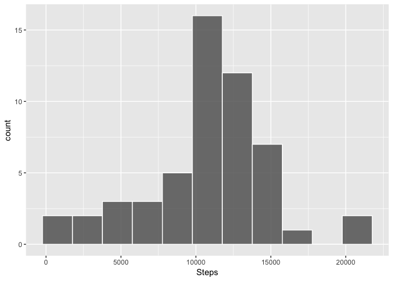
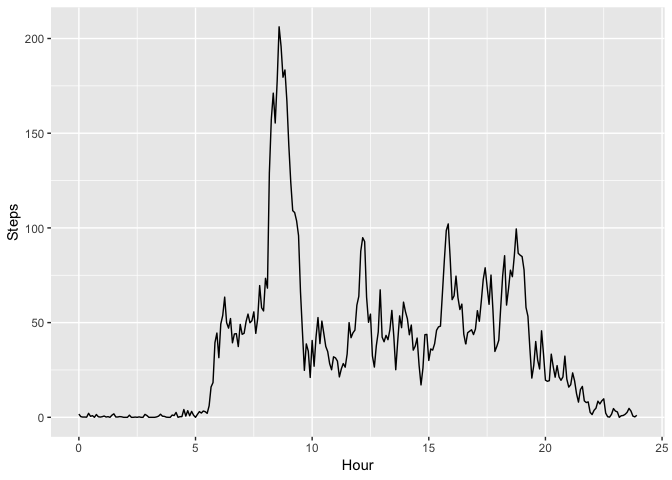
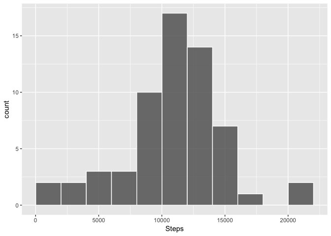
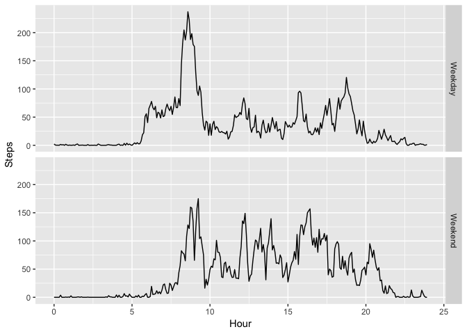

## 1. Loading and preprocessing the data 

The purpose of this step is to load the data and process it in order to have it in a usable format.  

The data were collected from a device that collects data at 5 minute intervals through out the day. The data consists of two months of data from an anonymous individual collected during the months of October and November, 2012 and include the number of steps taken in 5 minute intervals each day.

The dataset is available [here](https://d396qusza40orc.cloudfront.net/repdata%2Fdata%2Factivity.zip)

The variables included in this dataset are:

* **steps:** Number of steps taking in a 5-minute interval (missing values are coded as NA)
* **date:** The date on which the measurement was taken in YYYY-MM-DD format
* **interval:** Identifier for the 5-minute interval in which measurement was taken

### a. Loading the data

The following assumes that it is executed from the folder of the GIT repository where it is placed and that contains the activity.zip file. It reads the table and stores it within a data.frame named "activity".


```r
unzip("activity.zip")
activity <- read.csv("activity.csv")
```

### b. Transforming the data

For more convenience for processing the data during the next steps, the table is transformed into another data.frame named "activityClean" that contains two variables:

* **Steps (interger):** Number of steps taking in a 5-minute interval (missing values are coded as NA)
* **DateTime (Date):** The date on which the measurement was taken in YYYY-MM-DD format
* **Day (integer):** Weekday (1 being Sunday and 7 Saturday)
* **Hour (numeric):** Hour of the day when the measurement was taken


```r
DateTime <- strptime(paste(activity$date, sprintf("%004.0f",activity$interval)),"%Y-%m-%d %H%M")
activityClean <- data.frame(activity$steps,
                        as.Date(format(DateTime,"%Y-%m-%d")), 
                        wday(DateTime),
                        as.numeric(format(DateTime,"%H")) + as.numeric(format(DateTime,"%M"))/60)
colnames(activityClean) <- c("Steps","Date","Day","Hour")
```

## 2. What is mean total number of steps taken per day?

For this part, missing values in the dataset are ignored.

### a. Histogram of the total number of steps taken each day

The following code produces an histogram of the number of steps taken each day.


```r
library(ggplot2)
StepsByDay <- aggregate(data=activityClean,Steps ~ Date,FUN=sum,na.action="na.omit")
p <- ggplot(StepsByDay, aes(Steps)) 
p <- p + geom_histogram(binwidth = 2000, center = 10765, col = "white", alpha = .8)
print(p)
```

<!-- -->

### b. Mean and median total number of steps taken per day

The following code summarises the total number of steps taken each day.


```r
summary(StepsByDay$Steps)
```

```
##    Min. 1st Qu.  Median    Mean 3rd Qu.    Max. 
##      41    8841   10765   10766   13294   21194
```

Therefore, the average number of steps per day is 10766 and the Median is 10765.

## 3. What is the average daily activity pattern?

For this part, missing values in the dataset are ignored.

### a. Average number of steps taken, averaged across all days

The following code produces a time series plot of the 5-minute interval (x-axis) and the average number of steps taken, averaged across all days (y-axis).


```r
AvgStepsByInterval <- aggregate(data=activityClean,Steps ~ Hour, FUN=mean,na.action="na.omit")

p <- ggplot(data = AvgStepsByInterval, aes(x = Hour, y= Steps, group=1)) 
p <- p + geom_line()
print(p)
```

<!-- -->

### b. Interval conatining the maximum number of steps in a day

The following code indentifies the 5-minute interval, on average across all the days in the dataset, contains the maximum number of steps.


```r
result <- AvgStepsByInterval[AvgStepsByInterval$Steps==max(AvgStepsByInterval$Steps),]
paste("Interval with maximum number of steps:", result[1,1])
```

```
## [1] "Interval with maximum number of steps: 8.58333333333333"
```

The interval is therefore at 8h35.

## 4. Imputing missing values

In this part, we aim at impting data for the values that are missing in the initial data set.

### a. Total number of missing values in the dataset

The following code counts the number of NA data for the steps in the initial dataset.


```r
paste("The number of missing values is:", sum(is.na(activityClean$Steps)))
```

```
## [1] "The number of missing values is: 2304"
```

The number of missing values is therefore 2304.

### b. Filling strategy for all of the missing values in the dataset

The proposed approach the fill missing values in the calculate the average number of steps per week day for each interval and replace the missing values with this data.

### c. Creating a new dataset with imputed data

The strategy adopted for imputing the data is to replace the missing values by the average interval value for that day of the week during the same interval.

The following code imputes the missing values.


```r
activityClean2 <- activityClean[!is.na(activityClean$Steps),]

AvgStepsByWdayAndInterval <- aggregate(list(Steps = activityClean2$Steps), 
                                       by = list(Hour = activityClean2$Hour, Day = activityClean2$Day), 
                                       FUN = mean,na.action="na.omit")

AvgStepsByWdayAndIntervalStart2 <- rbind(AvgStepsByWdayAndInterval[289:2016,],AvgStepsByWdayAndInterval[1:288,])
Imputed <- c(rep(AvgStepsByWdayAndIntervalStart2[,3],8),AvgStepsByWdayAndIntervalStart2[1:1440,3])

AvgStepsByWdayAndIntervalInputed <- data.frame(activityClean[,1:4],Imputed)

AvgStepsByWdayAndIntervalInputed$Steps[is.na(activityClean$Steps)] <- AvgStepsByWdayAndIntervalInputed$Imputed[is.na(activityClean$Steps)]
```

### d. Histogram of the total number of steps taken each day

The following code produces an histogram of the number of steps taken each day (with imputed data).


```r
StepsByDay2 <- aggregate(data=AvgStepsByWdayAndIntervalInputed,Steps ~ Date,FUN=sum,na.action="na.omit")
p <- ggplot(StepsByDay2, aes(Steps)) 
p <- p + geom_histogram(binwidth = 2000, center = 11015, col = "white", alpha = .8)
print(p)
```

<!-- -->

### e. Mean and median total number of steps taken per day

The following code summarises the total number of steps taken each day (with imputed data).


```r
summary(StepsByDay2$Steps)
```

```
##    Min. 1st Qu.  Median    Mean 3rd Qu.    Max. 
##      41    8918   11015   10821   12811   21194
```

Therefore, the average number of steps per day is 11015 and the Median is 10821.
These values are slghtly higher than when removing the missing values from the calculations.

## 5. Are there differences in activity patterns between weekdays and weekends?

In this part imputed data is used for the missing values.

### a. Creating variable in the dataset with two levels -- "weekday" and "weekend"

The Following code adds a new variable to the dataset used above:

* **DayType (char):** Text describing whether measurment was performed on a weekday or a weekend 


```r
AvgStepsByWdayAndIntervalInputed$DayType <- "Weekend"
AvgStepsByWdayAndIntervalInputed$DayType[which(AvgStepsByWdayAndIntervalInputed$Day %in% 2:6)] <- "Weekday"
```

### b. Time series of the 5-minute interval and the average number of steps taken, averaged across all weekday days or weekend days

The following code produces a time series plot of the 5-minute interval (x-axis) and the average number of steps taken, averaged across all days (y-axis) for weekends and weekdays.


```r
AvgStepsWeekend <- aggregate(list(Steps = AvgStepsByWdayAndIntervalInputed$Steps), 
                by = list(Hour = AvgStepsByWdayAndIntervalInputed$Hour, DayType = AvgStepsByWdayAndIntervalInputed$DayType),
                FUN = mean,na.action="na.omit")

p <- ggplot(data = AvgStepsWeekend, aes(x = Hour, y= Steps)) + facet_grid(DayType~.)
p <- p + geom_line()
print(p)
```

<!-- -->
